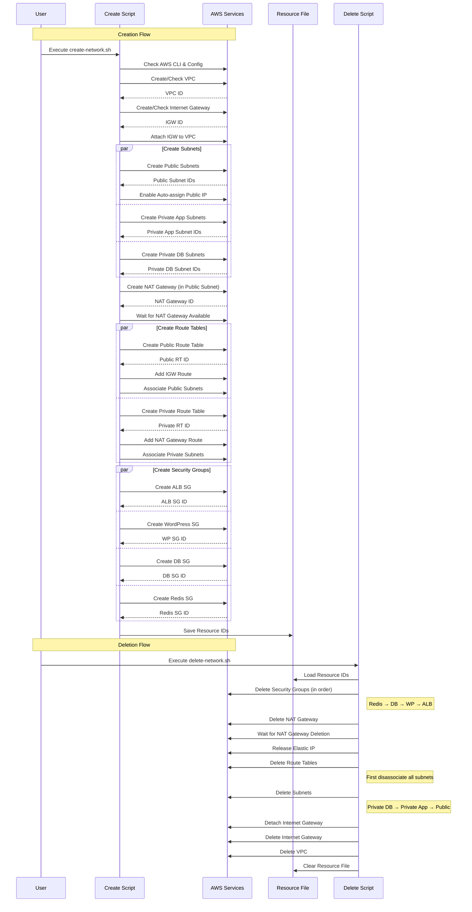

# AWS Network Scripts Sequence Diagram

### The diagram shows:

1. **Creation Flow**:
   - Proper order of resource creation
   - Parallel operations where possible
   - Dependencies between resources
   - Resource ID collection and storage

2. **Deletion Flow**:
   - Reverse order of deletion
   - Dependency-aware cleanup
   - Resource file handling

Key aspects highlighted:
- Parallelizable operations (subnet creation, security groups)
- Wait conditions (NAT Gateway)
- Resource dependencies (IGW → VPC, NAT → Public Subnet)
- File operations (saving/loading IDs)
- Proper deletion order to handle dependencies